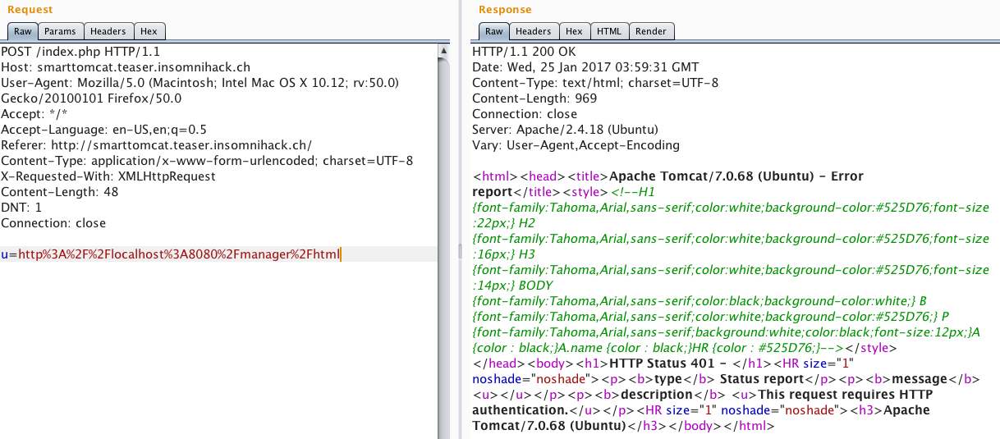
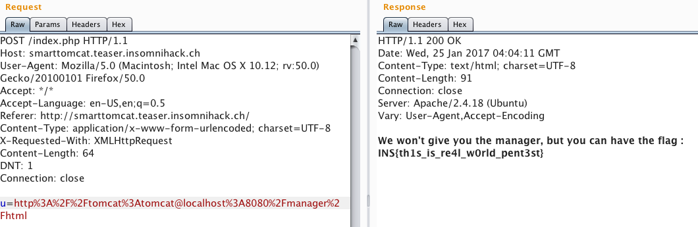

# smarttomcat

## Challenge
> Normal, regular cats are so 2000 and late, I decided to buy this allegedly smart tomcat robot
Now the damn thing has attacked me and flew away. I can't even seem to track it down on the broken search interface... Can you help me ?
>
> [Search interface](http://smarttomcat.teaser.insomnihack.ch/)

## Solution

The linked interface contains 4 things: a brief text description, a form that takes lat/long coordinates as input, a picture of an animatronic tomcat, and a dynamic map that plots the points submitted in the form. This is the text description:

```
LOST CAT

Yellow with black stripes.
Has fled to an unknown location.
Wants to kill all humans.
```

Well, that's not very helpful. A quick look in the developer console reveals that the form is actually submitted asynchronously with an AJAX request. At this point, I started up BurpSuite to further analyze the form submission. Here is what the request looks like.

```
POST /index.php HTTP/1.1
Host: smarttomcat.teaser.insomnihack.ch
User-Agent: Mozilla/5.0 (Macintosh; Intel Mac OS X 10.12; rv:50.0) Gecko/20100101 Firefox/50.0
Accept: */*
Accept-Language: en-US,en;q=0.5
Referer: http://smarttomcat.teaser.insomnihack.ch/
Content-Type: application/x-www-form-urlencoded; charset=UTF-8
X-Requested-With: XMLHttpRequest
Content-Length: 59
DNT: 1
Connection: close

u=http%3A%2F%2Flocalhost%3A8080%2Findex.jsp%3Fx%3D0%26y%3D0
```

The post body contains a request to a java service running on `localhost:8080`. Now the tomcat reference starts to make sense. This is an [Apache Tomcat](https://tomcat.apache.org/) server. After googling around for Apache Tomcat vulnerabilities, I find [this post](http://blog.opensecurityresearch.com/2012/09/manually-exploiting-tomcat-manager.html) about weak credentials in the manager interface. More googling reveals that the manager lives on `localhost:8080/manager/html`. I then modified the form submission post request to hit the manager (in the BurpSuite Repeater).



Empty credentials don't work, so I try some typical defaults before eventually selecting a winner (tomcat:tomcat).



The flag is `INS{th1s_is_re4l_w0rld_pent3st}`.
